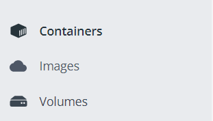

# **Utiliser docker**

## **Step 1: Paramétrer son conteneur**

### **A : Créer un Dockercompose**

Voir créer son Dockercompose

### **B : Définir les fichiers à ignorer**

Créer un fichier .dockerignore et mettre tous les fichiers, dossiers et extensions à ne pas copier dans les conteneurs.

```file
.git
*.py
```

## **Step 2 : Build un conteneur et le lancer**

Pour lancer les conteneurs après avoir effectuer le build il suffit de faire une de ces deux commandes. Le choix dépend de la version de **docker compose** installée.

```shell
docker-compose up -d --build
```

ou

```shell
docker compose up -d --build
# Version 2.0 de docker compose, pour les versions de docker >= 20.10.13
```

### **Lancer un conteneur sans reinstaller les dépendances**

L'option --no-recreate empêche la recréation des conteneurs existants, ce qui signifie que Docker Compose ne reconstruira pas les images ni ne réinstallera les dépendances. Il suppose que les conteneurs existants ont déjà les dépendances nécessaires installées. Cela est pretique pour relancer un conteneur rapidement. Cependant dans le cas d'un changement dans le code ou d'une version de librairie dans un fichier requirement il faut pas utiliser cette option car elle ignorera les changements efféctués.

```shell
docker-compose up -d --build --no-recreate
```

## **Step 3 : Vérifier le statut des conteneurs**

### **Option A : Windows / Docker dekstop**

Sur windows il est possible de visualiser via l'application docker dekstop le statut de ses conteneurs, ses images ainsi que ses volumes.  

<p align="center">
  
</p>

Onglet conteneurs :
L'onglet conteneurs permet de voir les conteneurs arrêter, en éxecution, en créattion ainsi que de consulter les logs. On peut également mettre les conteneurs en pause, les relancer et ouvrir un terminal à l'intérieur du conteneur lorsque ceclui-ci est en éxecution.

### **Option B : Linux / Portainer**

Pour utiliser portainer sur des conteneurs en local il faut ouvrir une page web après avoir lancer docker sur la page :
[localhost:9443](https://localhost:9443)

Comme pour l'aplication docker on peut consulter l'état de ses conteneurs, les relancers, lire les logs...

## **Step 4 : Eteindre les conteneurs (facultatif)**

```shell
docker-compose down
```
