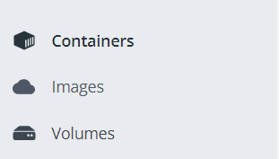

# **Using Docker**

## **Step 1: Set up your container**

### **A: Create a Docker Compose file**

See how to create your Docker Compose file.

## **Step 2: Build and launch a container**

To launch the containers after performing the build, you can use either of these two commands. The choice depends on the version of **Docker Compose** installed.

```shell=
docker-compose up -d --build
```

or

```shell
docker compose up -d --build
# Version 2.0 of docker compose, for Docker versions >= 20.10.13
```

### **Launching a container without reinstalling dependencies**

The --no-recreate option prevents the recreation of existing containers, which means Docker Compose will not rebuild the images or reinstall dependencies. It assumes that the existing containers already have the necessary dependencies installed. This is convenient for quickly relaunching a container. However, if there are any changes in the code or library versions in a requirements file, this option should not be used as it will ignore the changes made.

```shell=
docker-compose up -d --build --no-recreate
```

## **Step 3: Check the status of containers**

### **Option A: Windows / Docker Desktop**

On Windows, it is possible to view the status of containers, images, and volumes using the Docker Desktop application.

<p align="center">
  
</p>

Containers tab:

The Containers tab allows you to view stopped, running, and creating containers, as well as check the logs. You can also pause, restart, and open a terminal inside the running container.

### **Option B: Linux / Portainer**

To use Portainer for local containers, open a web page after launching Docker at:
[localhost:9443](https://localhost:9443)

Similar to the application, you can check the status of your containers, restart them, and view the logs.

## **Step 4: Shutdown the containers (optional)**

```shell=
docker-compose down
```
